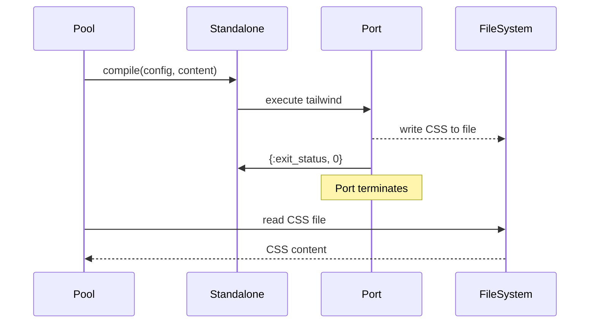
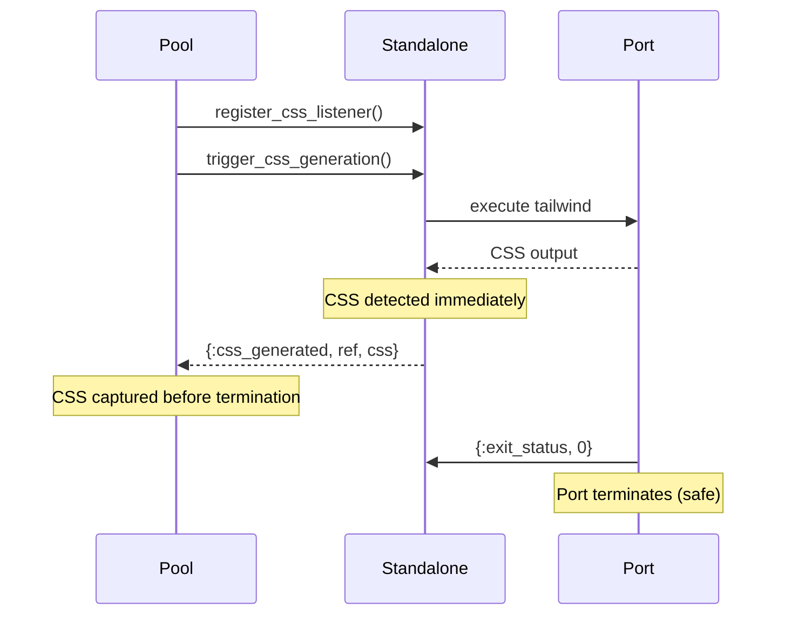

# TailwindPort Lifecycle Study Guide

## Overview

This guide provides comprehensive study materials for understanding the TailwindPort lifecycle, timing patterns, and the recently implemented CSS generation timing fixes.

## Table of Contents

1. [Core Architecture](#core-architecture)
2. [Process Lifecycle](#process-lifecycle)
3. [Timing Patterns](#timing-patterns)
4. [CSS Generation Flow](#css-generation-flow)
5. [Critical Timing Issues](#critical-timing-issues)
6. [Study Materials](#study-materials)
7. [Debugging Techniques](#debugging-techniques)

## Core Architecture

### Pool-Standalone Pattern

```
┌─────────────────┐    ┌─────────────────┐    ┌─────────────────┐
│     Pool.ex     │ -> │  Standalone.ex  │ -> │ TailwindCSS CLI │
│  (Management)   │    │  (Port Process) │    │   (OS Process)  │
└─────────────────┘    └─────────────────┘    └─────────────────┘
```

**Key Components:**
- **Pool**: Resource management, port pooling, intelligent reuse
- **Standalone**: GenServer wrapping individual TailwindCSS port processes
- **Port**: Erlang port connecting to TailwindCSS CLI binary

### State Management

#### Pool State
```elixir
%{
  port_pool: %{config_hash => port_info},
  config_cache: %{config_hash => {config, timestamp}},
  active_watches: %{watch_id => {port, files}},
  compilation_queue: :queue.new(),
  stats: %{...}
}
```

#### Standalone State
```elixir
%{
  port: port(),
  latest_output: binary(),
  last_css_output: binary(),
  preserved_css: binary(),
  css_listeners: [%{pid: pid(), ref: ref()}],
  health: %{...}
}
```

## Process Lifecycle

### 1. Pool Initialization

```
start_link() -> init() -> {:ok, state}
```

- Initializes empty pools and caches
- Schedules periodic cleanup
- Sets up telemetry metrics

### 2. Port Creation

```
compile() -> find_or_create_port() -> create_new_port() -> start_tailwind_port()
```

**Steps:**
1. Hash configuration for reuse
2. Check existing pool for matching port
3. Create new Standalone process if needed
4. Initialize port with TailwindCSS CLI

### 3. CSS Generation

#### Original Problematic Flow
```
Standalone -> Port generates CSS -> Port exits -> Pool requests CSS -> ❌ Process dead
```

#### Fixed Flow with Immediate Capture
```
Standalone -> CSS detected -> Immediate notification -> Pool captures CSS -> Port exits (safe)
```

### 4. Process Termination

```
Port exit -> handle_info({:EXIT, port, reason}) -> cleanup -> demonitor
```

**Cleanup Steps:**
- Remove from port pool
- Update health metrics
- Emit telemetry events
- Cleanup temporary files

## Timing Patterns

### Critical Timing Windows

#### Port Startup (0-1000ms)
```
start_tailwind_port() -> Port.open() -> wait_until_ready() -> ready: true
```

- **Optimal**: 200-500ms
- **Acceptable**: 500-1000ms
- **Degraded**: >1000ms

#### CSS Generation (100-2000ms)
```
Port.command() -> TailwindCSS processing -> handle_info({port, {:data, css}})
```

- **Fast**: 100-500ms (simple themes)
- **Normal**: 500-1000ms (complex themes)
- **Slow**: 1000-2000ms (large content scans)

#### Port Termination (0-100ms)
```
CSS output -> {:exit_status, 0} -> Process termination
```

- **Critical Window**: 0-50ms between CSS and termination
- **Previous Issue**: CSS lost during this window
- **Fixed**: CSS captured immediately when generated

### Performance Characteristics

#### Pooled Operations
- **Cache Hit**: 10-50ms (port reuse)
- **Cache Miss**: 200-1000ms (new port creation)
- **Pool Exhausted**: Fails immediately

#### Degraded Mode Operations
- **File Read Fallback**: 50-200ms additional
- **State Extraction**: 100-500ms additional
- **Emergency CSS**: 10-50ms

## CSS Generation Flow

### Traditional File-Based Flow


### New Immediate Capture Flow


## Critical Timing Issues

### Issue 1: CSS Lost on Port Termination

**Problem:**
```elixir
# CSS generated and stored in state
%{latest_output: css, preserved_css: css}

# Port terminates immediately
{:exit_status, 0}

# Later extraction fails
GenServer.call(dead_pid, :get_state) # => {:noproc}
```

**Solution:**
```elixir
# Immediate notification when CSS detected
def handle_info({port, {:data, data}}, state) do
  if contains_css?(data) do
    css = extract_css(data)
    notify_css_listeners(state.css_listeners, css)  # <- KEY FIX
    {:noreply, %{state | latest_output: css}}
  end
end
```

### Issue 2: Race Condition in Pool Extraction

**Problem:**
```elixir
# Pool attempts extraction after port might be dead
def extract_css_with_fallbacks(pid, options) do
  case Standalone.state(pid) do  # <- May fail if process dead
    %{latest_output: css} -> css
    _ -> ""
  end
end
```

**Solution:**
```elixir
# Immediate capture pattern
receive do
  {:css_generated, ^ref, css} -> css  # <- Captured before termination
after timeout ->
  fallback_extraction()  # <- Only if immediate capture fails
end
```

### Issue 3: Timing Dependencies

**Before:**
- CSS generation → Port termination → CSS extraction
- **Dependency**: CSS extraction depends on port being alive

**After:**
- CSS generation → Immediate capture → Port termination
- **Independence**: CSS captured regardless of port lifecycle

## Study Materials

### Core Files to Study

#### 1. Pool.ex (Resource Management)
```
Key Functions:
- find_or_create_port/3: Port pooling logic
- run_tailwind_build_with_immediate_capture/4: New CSS capture
- extract_css_with_fallbacks/2: Fallback strategies
- finalize_compilation/5: Result processing
```

#### 2. Standalone.ex (Process Management)
```
Key Functions:
- handle_info({port, {:data, data}}): CSS detection
- notify_css_listeners/2: Immediate notification
- handle_info({:register_css_listener}): Listener registration
```

#### 3. Health.ex (Monitoring)
```
Key Metrics:
- css_builds: Count of CSS generation events
- total_outputs: All port outputs
- last_activity: Timing tracking
- errors: Error counting
```

### Study Exercises

#### Exercise 1: Trace CSS Generation
1. Start with `Pool.compile/2`
2. Follow through `perform_compilation/4`
3. Track CSS from generation to capture
4. Identify all timing dependencies

#### Exercise 2: Analyze Failure Modes
1. What happens if Standalone crashes during CSS generation?
2. How does Pool handle port exhaustion?
3. What are the fallback strategies for CSS extraction?

#### Exercise 3: Performance Analysis
1. Measure port creation vs reuse timing
2. Compare immediate capture vs file-based extraction
3. Analyze degraded mode performance impact

### Testing Scenarios

#### Timing Stress Test
```elixir
def stress_test_timing do
  # Generate CSS rapidly to test race conditions
  tasks = for i <- 1..100 do
    Task.async(fn ->
      {:ok, result} = TailwindPort.Pool.compile(opts, content)
      {i, byte_size(result.compiled_css)}
    end)
  end

  results = Task.await_many(tasks, 30_000)

  # Verify no empty CSS results
  empty_count = Enum.count(results, fn {_i, size} -> size == 0 end)
  assert empty_count == 0, "Found #{empty_count} empty CSS results"
end
```

#### Capture Method Analysis
```elixir
def analyze_capture_methods do
  results = for _i <- 1..50 do
    {:ok, result} = TailwindPort.Pool.compile(opts, content)
    Map.get(result, :capture_method, :unknown)
  end

  stats = Enum.frequencies(results)
  IO.inspect(stats, label: "Capture method distribution")

  # Should see high :immediate usage
  immediate_rate = Map.get(stats, :immediate, 0) / length(results)
  assert immediate_rate > 0.8, "Low immediate capture rate: #{immediate_rate}"
end
```

## Debugging Techniques

### 1. Enable Debug Logging
```elixir
# config/dev.exs
config :logger, level: :debug

# Look for key log patterns:
# "Pool: Immediate CSS capture successful"
# "Standalone: Notifying CSS listeners"
# "TailwindPort: CSS detected"
```

### 2. Telemetry Monitoring
```elixir
:telemetry.attach_many(
  "tailwind-port-debug",
  [
    [:tailwind_port_pool, :compile, :start],
    [:tailwind_port_pool, :compile, :stop],
    [:tailwind_port, :css, :done]
  ],
  &debug_handler/4,
  %{}
)

def debug_handler(event, measurements, metadata, _config) do
  IO.puts("Event: #{inspect(event)}")
  IO.puts("Measurements: #{inspect(measurements)}")
  IO.puts("Metadata: #{inspect(metadata)}")
end
```

### 3. State Inspection
```elixir
# Pool state
{:ok, stats} = TailwindPort.Pool.get_stats()
IO.inspect(stats.derived_metrics, label: "Pool metrics")

# Standalone state (if alive)
state = TailwindPort.Standalone.state(pid)
IO.inspect(%{
  css_available: not is_nil(state.latest_output),
  listeners: length(state.css_listeners),
  port_alive: not is_nil(state.port)
}, label: "Standalone state")
```

### 4. Timing Measurements
```elixir
def measure_css_generation do
  {time, result} = :timer.tc(fn ->
    TailwindPort.Pool.compile(opts, content)
  end)

  %{
    duration_ms: div(time, 1000),
    css_size: byte_size(result.compiled_css),
    capture_method: Map.get(result, :capture_method),
    success: byte_size(result.compiled_css) > 0
  }
end
```

## Advanced Topics

### 1. Port Pool Optimization

#### Cache Hit Rate Optimization
```elixir
# Monitor cache effectiveness
config_variations = pool_stats.config_variations
total_compilations = pool_stats.total_compilations
cache_hit_rate = pool_stats.cache_hits / total_compilations

# Optimal: >80% cache hit rate
# Poor: <50% cache hit rate
```

#### Pool Size Tuning
```elixir
# Monitor pool exhaustion
exhaustion_rate = pool_stats.pool_exhaustions / pool_stats.total_compilations

# Increase pool size if exhaustion_rate > 0.05 (5%)
```

### 2. CSS Capture Reliability

#### Capture Success Rate
```elixir
# Track capture method distribution
immediate_captures = count_by_capture_method(:immediate)
fallback_captures = count_by_capture_method(:file_based)
degraded_captures = count_by_capture_method(:degraded_fallback)

# Target: >90% immediate captures
```

#### Error Recovery Analysis
```elixir
# Monitor recovery effectiveness
emergency_css_count = count_warnings("emergency CSS stored")
total_generations = count_total_css_generations()

# Emergency rate should be <1%
emergency_rate = emergency_css_count / total_generations
```

### 3. Performance Profiling

#### Memory Usage Patterns
```elixir
# Monitor process memory
:erlang.process_info(pool_pid, :memory)
:erlang.process_info(standalone_pid, :memory)

# CSS content in memory
css_memory = byte_size(state.latest_output || "") +
             byte_size(state.last_css_output || "") +
             byte_size(state.preserved_css || "")
```

#### CPU Usage Analysis
```elixir
# Profile CSS generation
:fprof.start()
:fprof.trace_start()

result = TailwindPort.Pool.compile(opts, content)

:fprof.trace_stop()
:fprof.profile()
:fprof.analyse([{:dest, "tailwind_profile.txt"}])
```

## Conclusion

Understanding the TailwindPort lifecycle requires attention to:

1. **Timing Dependencies**: Process creation, CSS generation, termination
2. **Resource Management**: Pool efficiency, cache hit rates, cleanup
3. **Error Recovery**: Fallback strategies, degraded modes, emergency handling
4. **Performance Patterns**: Memory usage, CPU profiles, throughput metrics

The recent timing fix fundamentally changed the CSS capture pattern from **post-termination extraction** to **immediate capture**, eliminating the critical race condition and providing reliable CSS generation.

Continue studying these patterns, run the exercises, and monitor the metrics to develop deep understanding of the TailwindPort system.